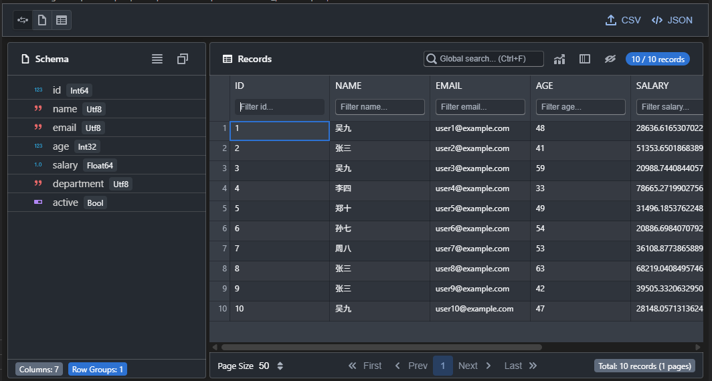

# Parquet Explorer

<div align="center">


A professional VS Code extension for viewing Apache Parquet files with an interactive interface.

[](https://marketplace.visualstudio.com/items?itemName=winse.parquet-explr)
[](https://open-vsx.org/extension/winse/parquet-explr)



</div>

## Features

- **Interactive Data Table** - Browse parquet records with a sortable, paginated table view
- **Schema Display** - View column definitions, types, and schema information
- **Export Capabilities** - Export data to CSV, JSON, or other formats
- **Native Integration** - Double-click .parquet files to open directly in VS Code
- **Theme Support** - Adapts to VS Code light and dark themes
- **Performance** - Efficient parsing using parquet-wasm with ZSTD support

## Installation

### From VS Code Marketplace

1. Open VS Code
2. Go to Extensions (`Ctrl+Shift+X`)
3. Search for "Parquet Explorer"
4. Click Install

### From VSIX Package

```bash
# Build the extension
npm run package

# Install the VSIX
code --install-extension parquet-explr-0.2.0.vsix
```

## Usage

### Opening Parquet Files

**Method 1: Double-click**

- Simply double-click any `.parquet` file in VS Code explorer

**Method 2: Command Palette**

1. Right-click a `.parquet` file
2. Select "Open in Parquet Explorer"
3. Or use `Ctrl+Shift+P` → "Parquet Explorer: Open"

### Navigating the Interface

- **Schema Panel** - Shows column names, types, and schema metadata
- **Records Panel** - Displays actual data in an interactive table
- **Pagination** - Navigate through large datasets
- **Sorting** - Click column headers to sort data

## Development

### Prerequisites

- Node.js 18+
- VS Code 1.78+
- npm or yarn

### Setup

```bash
# Clone the repository
git clone https://github.com/winse/parquet-explr.git
cd parquet-explr

# Install dependencies
npm install

# Install webview dependencies
cd webview && npm install && cd ..

# Build the extension
npm run compile
```

### Development Mode

```bash
# Watch for changes and rebuild
npm run watch
```

This will:

- Compile TypeScript in watch mode
- Bundle extension with esbuild in watch mode
- Use VS Code Extension Development Host to test

### Building for Release

```bash
# Production build
npm run package

# Create VSIX package
npm run pkg
```

### Project Structure

```
parquet-explr/
├── src/
│   ├── commands/           # VS Code commands
│   │   └── openParquetViewer.ts
│   ├── types/              # TypeScript type definitions
│   │   └── parquet.ts
│   ├── webview/            # Extension webview logic
│   │   ├── messageHandler.ts
│   │   ├── ParquetEditorProvider.ts
│   │   ├── ParquetProcessor.ts
│   │   └── WebviewManager.ts
│   └── extension.ts        # Extension entry point
├── webview/                # React webview application
│   ├── src/
│   │   ├── components/     # React components
│   │   │   ├── RecordsPanel.tsx
│   │   │   └── SchemaPanel.tsx
│   │   ├── hooks/          # Custom React hooks
│   │   │   ├── useParquetData.ts
│   │   │   └── useTheme.ts
│   │   ├── App.tsx         # Main app component
│   │   ├── App.scss        # Component styles
│   │   └── main.tsx        # Webview entry point
│   └── vite.config.js      # Vite configuration
├── images/                 # Extension icons
├── esbuild.config.js       # Extension bundler config
├── package.json            # Extension manifest
├── tsconfig.json           # TypeScript config
└── README.md
```

### Tech Stack

- **VS Code Extension API** - Custom editors and commands
- **React 18** - UI framework for webview
- **BlueprintJS** - UI component library
- **Vite** - Fast webview bundler
- **esbuild** - Extension bundler
- **parquet-wasm** - High-performance Parquet parser (WASM) with ZSTD support
- **TypeScript** - Type-safe development
- **Sass** - CSS preprocessing

### Available Scripts

| Command           | Description                       |
| ----------------- | --------------------------------- |
| `npm run compile` | Compile extension and check types |
| `npm run watch`   | Watch mode for development        |
| `npm run package` | Production build                  |
| `npm run pkg`     | Create VSIX package               |
| `npm run lint`    | Run ESLint                        |
| `npm run clean`   | Clean build artifacts             |

## Contributing

1. Fork the repository
2. Create a feature branch (`git checkout -b feature/amazing-feature`)
3. Commit your changes (`git commit -m 'Add amazing feature'`)
4. Push to the branch (`git push origin feature/amazing-feature`)
5. Open a Pull Request

## Acknowledgments

- [Apache Parquet](https://parquet.apache.org/) - Columnar storage format
- [parquet-wasm](https://github.com/kylebarron/parquet-wasm) - High-performance Parquet library with ZSTD support
- [BlueprintJS](https://blueprintjs.com/) - React UI toolkit
